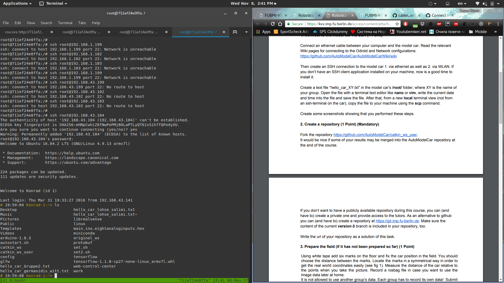
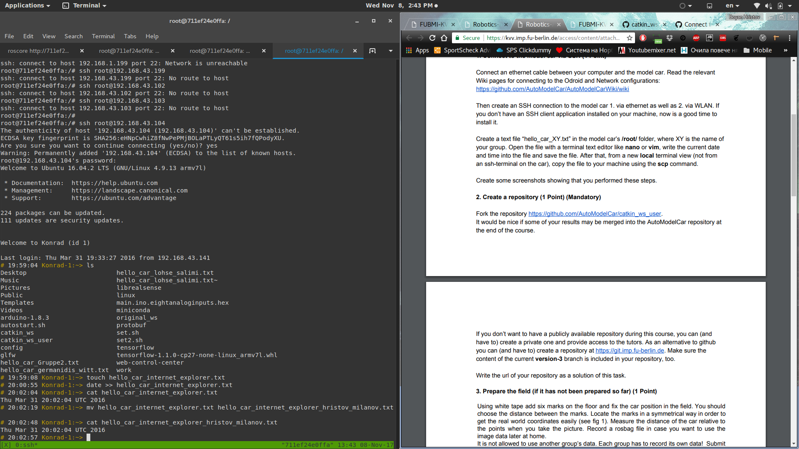
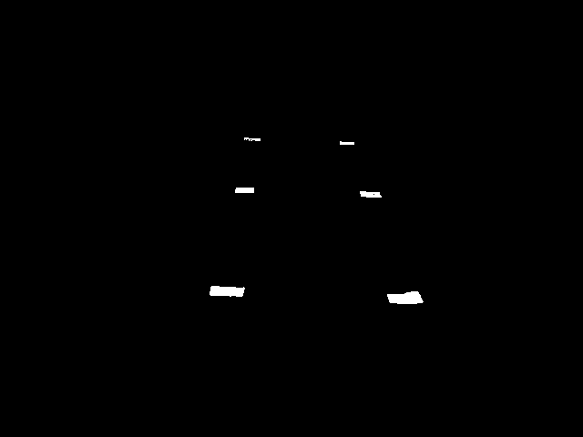

*InternetExplorer - Emil Milanov & Boyan Hristov*

# Homework 3

## Exercise 1
Connecting to the car:

\

\

we also copied the file and it's in our git repository, however we forgot to take screenshots of the process.
[Link to file](https://github.com/BoyanH/FU-Robotics-WS17-18/blob/master/Homework3/hello_car_internet_explorer_hristov_milanov.txt)

## Exercise 2
Link to git repository -> [ https://github.com/BoyanH/catkin_ws_user ]( https://github.com/BoyanH/catkin_ws_user )

## Exercise 3
*We have also uploaded the bag file in KVV*

Rosbag file -> [Link](https://github.com/BoyanH/FU-Robotics-WS17-18/blob/master/Homework3/internet_explorer_hristov_milanov_2016-03-31-20-56-28.bag)

## Exercise 4 - Grey and Black
Because the code for our next tasks is in the same file, and our solution to find the white pixels is 
computationally intensive,we disabled the constant publishing of the grayscale image. 
To enable it change line 28 of the script file to `self.stream_gray_image = True`.

The published topic is `app/camera/gray_scale/image_raw`. To view it, add as `_do_dynamic_scaling:=true` as
additional parameter to the `image_view` command.

For the black image we're using an adaptive threshold. We are comparing the brightness of a pixel in relation
to nearby pixels. More details / comments in the code. (line 140)

\

## Exercise 5 - Camera Position and Orientation
The only problem we had with the `solvePnP` function, was that one of our arrays was not in `np.float32` type
and the function was throwing errors, which were hard to interprete, but we figured it out eventually. 
The program prints the rotation and translation vector to the console.

For the next part, we used the C++ implementation as a baseline, however we're not sure if the output makes sense.
The program prints what we think is the camera coordinates and rotation in Euler Angles.
