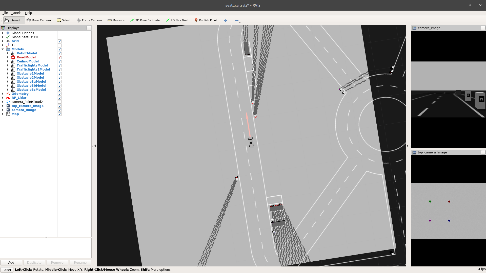
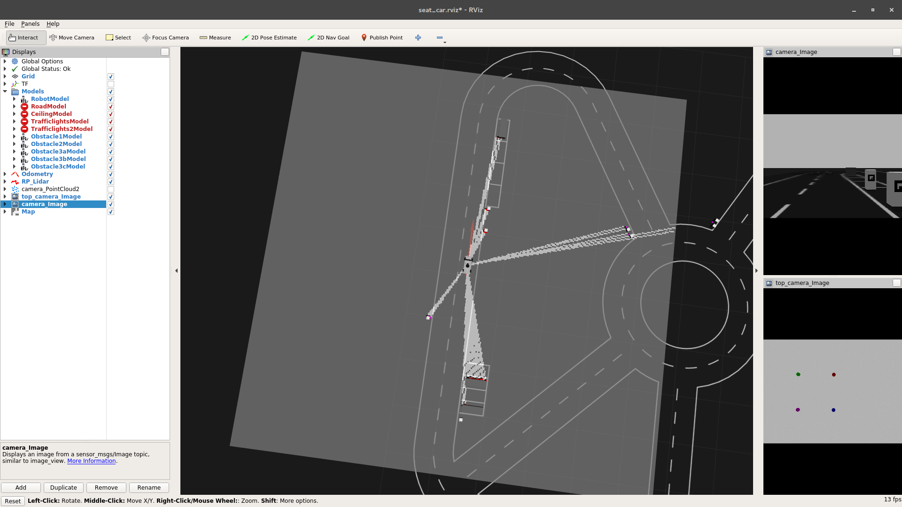

*InternetExplorer - Boyan Hristov*

# Homework 4

## Exercise 1

What I find better is to assume everything is free until we find an obstacle, everything behind the obstacle is unknown


\

But an alternative approach (from what I remember discussed in tutorium) is also available.


\

One can simply toggle the flag FLAG_NO_OBSTACLE_MEANS_FREE in the python code to switch between the 2 versions.

Link to git repository with code + screenshots + bags (main repo) -> https://github.com/BoyanH/FU-Robotics-WS17-18
Link to catkin_ws_user repository -> https://github.com/BoyanH/catkin_ws_user

## Exercise 2

I wasn't able to complete the exercise in the lab, so I brought 7 bag files home which I used to complete the exercise.
Although the output seems really bad, I think it is quite similar to the behavior of the car (somehow it had problems turning one way).

### Table
This is the JSON output of the program (also input for the mapper function). Of course, as it is JSON generated from a dictionary,
the keys aren't really ordered that way. I reordered them for better readability, reformated the JSON a bit by hand


```Python
{
    "0": 30.277643233954862,
    "30": 29.38100247745021,
    "60": 48.934635590751135,
    "90": 73.59105680295431,
    "120": 84.95944850718526,
    "150": 75.46084026905402,
    "179": 104.04333005742643,
}
```

For debugging purposes, all bags are available in the git repository.

### Mapper

As I didn't have much time, the mapper implementation is quite simple

```Python
def prepare_mapping_function():
    global expected_vs_received, map_steering

    # can also read from saved json
    if len(expected_vs_received.keys()) == 0:
        with open('calibration.json') as json_data:
            expected_vs_received = json.load(json_data)

    rospy.loginfo(expected_vs_received)
    lm = LinearRegression()
    y_train = list(map(lambda x: float(x), expected_vs_received.keys()))
    X_train = list(map(lambda x: [float(expected_vs_received[x])], expected_vs_received.keys()))

    rospy.loginfo(y_train)
    rospy.loginfo(X_train)
    lm.fit(X_train, y_train)

    map_steering = lambda x: lm.predict(x)[0]
```

We use an already implemented version of linear regression from sklearn, train it with the data we calculated in the previous exercise. The mapper is simply
a linear regression prediction. I studie the algorithm in the "Mustererkennung" course a couple of weeks ago, is still in my GitHub account, didn't want to copy the whole code here.

