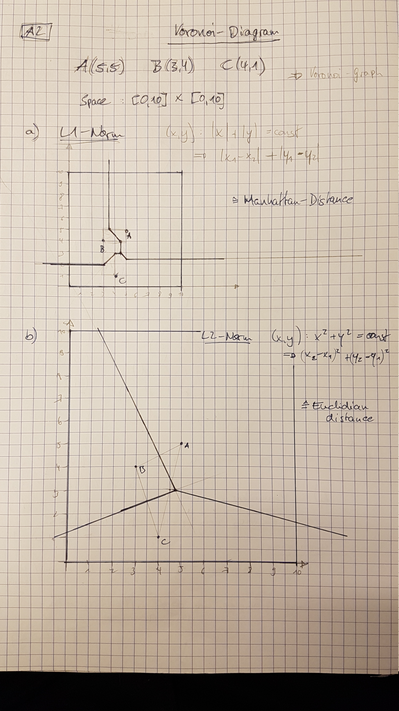
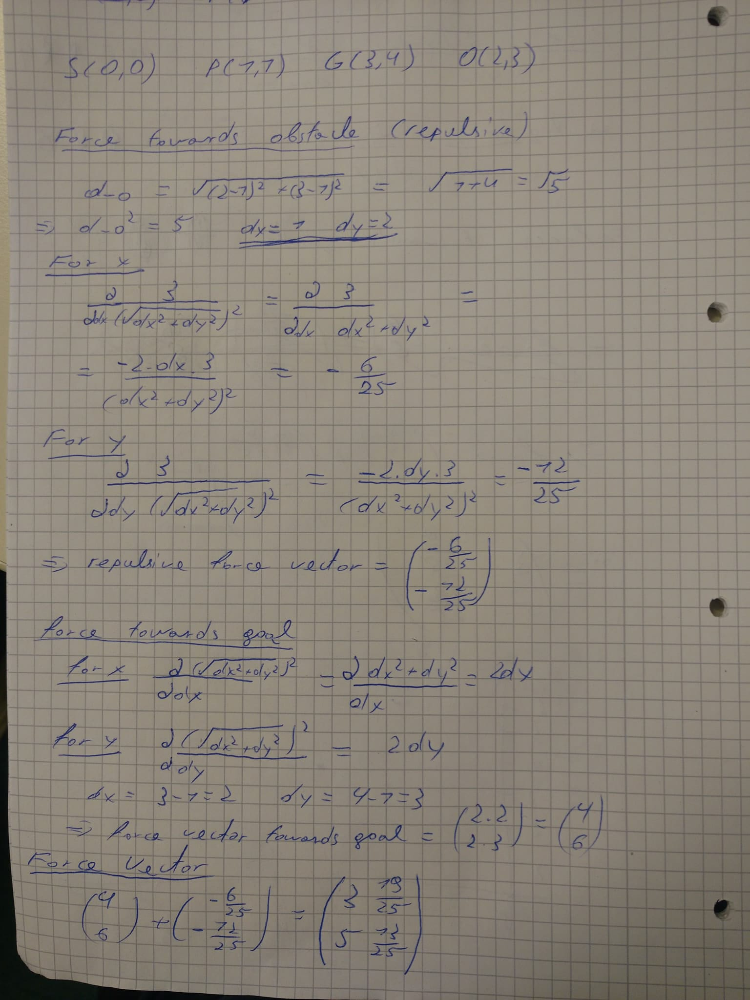

*Boyan Hristov, Gerrit Hiderland, Jonas Piotrowski – Gruppe 2*

# Homework 12

## Exercise 1 a)

1.  Step
  - Open: (h)
    - g'(h, h, G') + sigma(h) = 0 + 19 = 19 
  - Closed: ()
1.  Step
  - Open: (g,e,d,c)
    - g'(h, g, G') + sigma(g) = 10 + 1 = 11
    - g'(h, e, G') + sigma(e) = 10 + 20 = 30
    - g'(h, d, G') + sigma(d) = 10 + 35 = 45
    - g'(h, c, G') + sigma(c) = 10 + 42 = 52
  - Closed: (h)
1.  Step
  - Open: (e, f, d, c)
    - g'(h, e, G') + sigma(e) = 10 + 20 = 30
    - g'(h, f, G') + sigma(d) = 20 + 18 = 38
    - g'(h, d, G') + sigma(d) = 10 + 35 = 45
    - g'(h, c, G') + sigma(c) = 10 + 42 = 52
  - Closed: (h, g)
1.  Step
  - Open: (f, d, c)
    - g'(h, f, G') + sigma(d) = 20 + 18 = 38
    - g'(h, d, G') + sigma(d) = 10 + 35 = 45
    - g'(h, c, G') + sigma(c) = 10 + 42 = 52
  - Closed: (h, g, e)
1.  Step
  - Open: (b, d, c)
    - g'(h, b, G') + sigma(b) = 10 + 20 = 30
    - g'(h, d, G') + sigma(d) = 10 + 35 = 45
    - g'(h, c, G') + sigma(c) = 10 + 42 = 52
  - Closed: (h, g, e, f)
1.  Step
  - Open: (__a__, d, c)
    - g'(h, a, G') + sigma(a) = 40 + 0 = 40
    - g'(h, d, G') + sigma(d) = 10 + 35 = 45
    - g'(h, c, G') + sigma(c) = 10 + 42 = 52
  - Closed: (h, g, e, f, b)

Here is the real path to a vertex always the best path that we found so far. Therefore, when one wants to implement this algorithm, it is always
a good idea to save the best path so far to each vertex and the previous vertex on that best path and update them accordingly when a better
path is found.

If one saves the previous of each vertex, we would be able to trace back the found path from the end vertex. It would look like this (when traced back 
and inverted): h -> g -> f -> b -> a

## Exercise 1 b)

* consistent: No. An example prooving inconsistency are the vertexes h and g. sigma(h) > sigma(g) + g(h, g), because 19 > 1 + 10.
* optimisic: No. sigma(d) = 35 > g(d, a) = 10.
* implications:
  * because of inconsistency, the ``hard`` form of A* will not always find an optimal solution
  * because of non-optimistic, the ``soft`` form of A* also will not always find an optimal solution
  

## Exercise 2

{ height=80%; width=100%; }\

## Exercise 3

\

